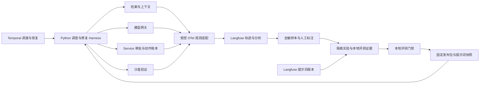

# Langfuse 接入与 Agent 效果优化

状态：**planned**。2026-09-20 确定接入方向；本文是待实施契约，当前仓库没有 Langfuse SDK、部署配置或已完成的联调。本轮不启用外部数据上传。后续交付分别记录 implemented、verified、operated 及证据。

## 目标与交付能力

将 Langfuse 作为 LLM 观测、提示词管理和实验协作平台，直接接入现有 Python Harness。目标是让研发人员能从一次失败定位到证据、模型、工具或验证阶段，把失败转成评测样本，再以相同任务和预算验证改进。接入不以“控制台出现一条 trace”为完成标准，也不依赖引入 LangGraph。

| 能力 | 完成后的实际用途 | 验收产物 |
|---|---|---|
| 逐轮调查与修复轨迹 | 看清每轮证据变化、模型提议、停止原因及验证失败 | 单次调查、多轮调查、候选修复各一条真实模型轨迹 |
| 质量、费用和耗时归因 | 找出无收益的检索、重复生成、昂贵模型及慢工具 | 按任务族、发布版本和策略比较的报告 |
| 提示词版本管理 | 比较调查/修复提示词，关联每次调用实际使用的版本 | 两个候选版本、固定快照、回归结果与回滚演示 |
| 数据集与实验 | 将失败样本转为独立案例，比较模型、检索及循环策略 | 数据集快照、逐案例结果、实验链接和本地原始报告 |
| 自动评分与人工反馈 | 组合确定性验证、人工标注和经过校准的模型评分 | 评分定义、标注记录、分歧案例与评分器版本 |
| 改进与发布闭环 | 从实验中选择有收益的配置并绑定发布，保留旧任务版本 | 一次从失败归因到候选评测、门禁和回滚的演示 |

## 架构与职责

- Temporal 继续管理长任务等待和恢复；Langfuse 不推进任务，不重发模型/工具调用。
- Service、动作账本和外部权威回执决定授权及业务状态；Langfuse 展示这些状态的观测副本。
- Prometheus/OTel 保留基础设施与运行指标。Langfuse 增加模型调用、上下文、提示词及质量分析；现有审计包继续承担业务记录导出。
- Langfuse 管理候选提示词与实验；运行时消费已经导出并通过门禁的提示词快照。平台不可用不改变在途任务的提示词。
- 采用 Langfuse Python SDK 的 OTel 接入能力与手工 observation，适配现有 HTTPX 模型网关。不得假设安装 SDK 就能自动识别 Anthropic HTTP 请求的 usage 和结构化决策。

## 观测模型与跨进程关联

一个任务对应一个带租户命名空间的 session；一个实际执行段（如一次 Worker tick）对应一个 trace，模型、检索、工具与验证是其子 observation。等待审批期间关闭 span，通过 session、业务身份与前序 span link 连接后续执行段，避免维持数天的活动 span。UI 是否完整展示 links 要在选定版本实测，不能只凭 ID 相同宣称链路已连通。

| 对象 | 业务关联字段 | 记录内容 |
|---|---|---|
| 任务执行段 | tenant/task、release_id、workflow、执行尝试 | 阶段、等待/停止原因、排队时长、主动执行时长 |
| 调查轮次 | round_id/ordinal、context_digest | 查询摘要、证据 ID/版本/行范围、引用有效性、新增证据数 |
| 模型 generation | 持久化推理身份、模型、prompt_version/digest | 实际请求次数、usage、价格版本、耗时、输出校验结果 |
| 修复与验证 | repair_run、candidate ordinal、verification token | 补丁摘要、基线/候选结果、失败类别、验证重试 |
| 工具动作 | operation_id、工具类型、执行尝试 | 提议、批准、派发、UNKNOWN、查询与确认分别记录 |
| 评分与实验 | dataset/item/run、evaluator version、目标 observation | 分值或分类、来源、理由摘要、原始证据引用 |

字段通过白名单导出；业务标识在外部平台使用租户隔离的稳定伪名，内部保存关联映射。trace/span ID 不作为推理、动作或实验案例的幂等键。

具体实现要求：

1. API 创建任务时保存允许传播的 trace 上下文，经 Outbox、Dispatcher、Temporal Activity 传递；Workflow 中不初始化 SDK、不读网络、不生成非确定性遥测。重放不重复发出业务 observation。
2. 现有 `Telemetry` 创建独立 `TracerProvider`。实现时明确 Langfuse 与它如何共享 provider 或显式传递上下文，避免再建一套未关联的 root span；每个进程只初始化一次客户端，并覆盖线程切换。
3. 每次真实推理生成一条 generation。读取已持久化决策时记 `result_reused`，关联原推理身份，不伪造新的模型调用或重复计费；实际再次尝试使用独立 span ID。
4. 响应丢失或被拒绝时，usage 可为未知，记录计费状态与预算预留。未知不记为零，也不把保守费用预留冒充供应商实测费用。Langfuse 费用展示不能反向覆盖本地账本。
5. token/缓存统计只记录供应商实际返回且适配器支持的字段。总任务成本、单个成功任务成本分别列明失败任务及评测模型的花费。
6. 批量异步导出设置队列上限、请求超时和关闭 flush 上限；CLI 退出有界 flush，Worker 正常关闭有界排空，硬杀可能丢失未导出遥测。记录丢弃数和导出故障，禁止通过重新执行任务补 trace。

## 提示词管理与发布固定

先管理 `investigation`、`investigation_loop`、`repair_candidate` 的模型指令；工具 Schema、权限和预算仍由代码约束。Langfuse 版本/标签用于编辑与候选选择；`production` 等可移动标签不得在每轮运行时重新解析。

构建时将选择的提示词解析成明确版本，导出模板、变量契约、配置和内容摘要，纳入新版本 AgentRelease。模板变量以任务数据填充，不允许模板加载任意文件或执行表达式。模型请求摘要包含实际渲染内容，避免相同推理身份悄悄更换指令。

现有 AgentRelease v1 不含外部提示词清单，需新增清单版本与显式兼容加载路径；旧任务仍使用原内嵌提示词和旧发布。新发布预检必须验证提示词内容摘要、所需变量和模型配置，缺失或不匹配时拒绝新派发，不能静默回退到不同提示词。

运行阶段从固定本地快照加载。Langfuse 停机时已部署发布可继续运行；构建阶段无法取得被选择的版本时返回明确失败。回滚只改变新任务采用的发布，不改写在途任务版本。评测器提示词单独版本化，不进入被评 Agent 的上下文。

## 数据集、评分与能力实验

Langfuse 的 dataset/experiment 用于协作和比较；每次正式实验另导出不可变的本地输入快照、逐案例输出和评测原始证据，并计算摘要。失败轨迹经去敏、去重、参考答案核验后进入开发集；按业务实体及模板族隔离开发、校准与冻结验收集，不能把验收答案加入 few-shot、记忆或优化器。

评分至少分为三类：

- **确定性评分：**结构合法、引用存在且有效、修复通过独立验收、重复副作用、预算/次数超限。授权违规和额外副作用是硬门槛。
- **人工评分：**调查结论、证据充分性、可操作性、修复适用性；记录标注人、量表版本及分歧裁决。接受候选不等于已部署成功。
- **LLM-as-a-Judge：**对开放式结论按固定量表评分，绑定模型、提示词、输入及评测预算；先用人工样本检查一致性和偏差。缺失、超时或格式无效记为证据不足，不能默认通过；模型评分不能覆盖独立测试失败。

实验 runner 调用现有 Harness，隔离任务、数据库、源码快照和工具凭证，禁止实验模式派发企业写动作。真实只读资源也须明确固定输入或记录采集时间。并发上限、候选数、Agent 与 judge 总预算在启动前固定；中断后按案例/重复次数/版本身份恢复，未决付费调用不盲目重跑。

优先完成以下三组实验，之后才用同一底座评估模型路由、多 Agent 和长期记忆：

| 实验 | 简单基线 | 候选与要回答的问题 |
|---|---|---|
| 调查 | 单次 `investigate` | `investigation_loop` 多轮是否得到更充分证据？按统一预算上限报告质量与实际费用，不能只比较调用次数不同的平均分 |
| 检索 | lexical、无检索 | BM25/RRF，之后扩展向量/重排；同时测召回和最终结论，避免只提升检索分数 |
| 修复 | 单候选、相同预算的独立多候选 | 带验证反馈的有界修复；分别报告候选成功率、最终选中结果与累计成本，验证收益是否来自反馈 |

报告必须包含任务成功率、证据正确性、人工接管率、每任务/每成功任务成本、端到端及主动执行 P50/P95 时延、失败分类、样本数和缺失数。采用配对案例与重复运行，报告置信区间和任务族分层；预算不足或样本不足明确为探索结果。发布前预先固定质量下限、成本/时延上限及退化容忍度，不在看完候选后调低阈值。

线上评分和用户反馈用于发现问题，不能直接训练或自动发布。闭环完成标准是保留至少一次“失败轨迹 → 标注案例 → 策略修改 → 基线对照 → 发布判断”的完整记录；候选无收益也必须保留结果，不能把接入工具本身当成质量提升证据。

## 数据范围、部署和故障处理

开发与实验优先使用合成或已授权的去敏材料。企业材料默认只导出元数据和摘要；经来源出站策略允许的内容才可在独立项目启用去敏输入/输出，以支持有效诊断。允许发送给模型供应商不意味着自动允许发送给 Langfuse。

脱敏在应用构造 observation 时执行，并在 exporter 层复核；凭证、HTTP headers、原始异常、源码与用户内容不得通过自动参数捕获旁路上传。多个 OTel exporter 分别验证过滤规则；Langfuse 的 masking 不会自动清洗本地或其他 exporter。脱敏失败丢弃受影响遥测并记计数，不退回原文导出。

租户标签不能代替访问控制。首期使用独立 Langfuse project/凭证隔离租户与开发、验收、生产环境；确认所选部署版本的成员权限后再开放控制台。工作台仅在当前业务授权和 Langfuse 项目权限均成立时提供追踪入口，不提供公开分享链接。数据集与导出文件执行同等保留、删除和访问策略。

部署选择：本地/企业测试环境优先提供独立自托管配置；托管服务作为同一适配器的可选后端，要求配置端点与数据地域。新增独立 observability profile 或 Compose 文件，不把完整 Langfuse 依赖默认塞入核心应用启动。实现时锁定 SDK、服务版本和镜像摘要，确认基础设施、功能许可及容量要求，并记录升级测试。

拟新增配置契约（**当前 Settings 尚不支持，不是可直接使用的配置**）：观测启用开关、端点、project 凭证引用、`metadata/redacted` 内容模式、采样率、队列容量、导出/flush 超时、保留策略和实验费用上限。凭证仅在服务端持有。普通运行可采样，固定实验必须完整记录预期案例；丢失的必需实验记录会阻止形成通过结论。

Langfuse 网络故障不改变业务执行结果，不消耗业务工具重试预算。实验可以保留本地结果待后续上传；所需输入/评分缺失时门禁返回证据不足。高质量观测依赖真实开销测量：比较启用前后 P95、CPU、内存与队列积压，不承诺异步导出没有开销。

## 实施切片与验收

全部为未完成任务；按 LF-01 → LF-02 → LF-03 → LF-04 顺序推进，LF-01 随真实模型闭环一起完成，不等全部 B10 建设结束。

| 切片 | 修改范围（拟） | 必须通过的验收 |
|---|---|---|
| LF-01 端到端观测 | `telemetry.py`、新观测适配器、`config.py`、`runtime.py`、API/Outbox 关联、`model.py`、调查/修复/检索/验证入口、依赖及独立部署配置 | mock 导出与真实 Langfuse 服务；三类真实模型轨迹；重试/决策复用不重复计费；并发租户不串链；撤权/脱敏、断网/队列满/进程退出与开销报告 |
| LF-02 评分与实验 | 新实验 runner 和 Langfuse 数据适配器、`evaluation.py`/`retrieval_evaluation.py`、反馈 API 与工作台、独立实验配置 | 固定数据集三组对照；人工与 judge 校准；失败入库；费用预算和中断恢复；完整本地证据与平台关联 |
| LF-03 提示词与发布 | 模型网关、提示词快照加载器、`releases.py`、版本化清单与构建预检 | 指定版本导出；变量/摘要校验；移动标签不改变旧任务；离线运行、平台停机与回滚演示；旧清单兼容 |
| LF-04 优化门禁 | `evaluation_gate.py` 的新证据 schema、CI、运维说明、工作台实验入口 | 原始结果重算；质量/费用/时延回归阻断；不完整评分判证据不足；一次完整优化及回滚演示 |

LF-01 先用当前代码内嵌提示词摘要关联调用；LF-02 可比较不同代码/模型/上下文配置；LF-03 完成后再比较平台管理的提示词版本。现有离线门禁保持可单独运行，新能力使用显式新 schema 与入口，禁止直接把 Langfuse 汇总分数塞进原报告冒充原始证据。

真实模型、Langfuse 服务、容器和企业环境的验收分别记录；缺少某项只标为待验收。至少交付部署启动说明、去敏轨迹截图/链接、实验及原始报告、提示词快照、故障与性能报告。默认测试使用 fake exporter/transport，不依赖外部服务、不产生付费推理；真实测试使用独立凭证与明确预算。

## 官方参考

以下官方文档于 2026-09-20 核对，具体 API 与功能可用性在实现时按锁定版本复核：

- [Observability](https://langfuse.com/docs/observability/overview)：模型、检索和工具调用追踪及费用分析。
- [Python SDK / OTel](https://langfuse.com/docs/observability/sdk/overview)：接入与 SDK 生命周期。
- [Evaluation](https://langfuse.com/docs/evaluation/overview) 与 [Experiments via SDK](https://langfuse.com/docs/evaluation/experiments/experiments-via-sdk)：评分、数据集及对照实验。
- [Prompt Management](https://langfuse.com/docs/prompt-management/overview) 与 [Prompt Version Control](https://langfuse.com/docs/prompt-management/features/prompt-version-control)：提示词版本和标签。
- [Masking](https://langfuse.com/docs/observability/features/masking)：出站脱敏与多 exporter 边界。
- [Self-hosting](https://langfuse.com/self-hosting)：自托管部署与基础设施要求。
