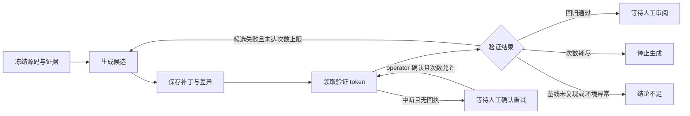

# 有界候选修复操作说明

这个里程碑交付的是：任务证据与本地源码 → 持久化模型补丁 → 基线/候选容器验证 → 必要时再生成 → 人工审阅。最多生成 3 个候选，不修改原 checkout，不推送代码，不创建真实 PR，不合并或部署。通过回归验证不等于任务业务成功。

## 启用与创建任务

1. 运行 `make migrate` 升级至 `0006_repair_runs`。生产运行角色需要获得两张新表的读写授权，仍不得拥有表或绕过 RLS；迁移本身不会给运行角色提权。
2. 准备运维管理的本地源码目录及目录外的 oracle。仓库绑定参考 [repair-manifest.json](../examples/repair-manifest.json)，填写绝对 `source_root`，限定 tenant/project/environment/resource/subjects。确认该源码允许发往模型服务后，设置绑定的 `allow_model_export=true`。
3. 配置 `AGENT_EXECUTION_MODE=live`、`AGENT_ALLOW_MODEL_API=true`、模型 ID/密钥及正数单价；再配置 `AGENT_ALLOW_CANDIDATE_EXECUTION=true`、`AGENT_REPAIR_MANIFEST`、`AGENT_SANDBOX_IMAGE`、`AGENT_SANDBOX_ORACLE`。镜像必须以 digest 固定且已存在于本地；容器内需有 Python 与 pytest。
4. 启动 API、Worker 和 Dispatcher。工作台选择“研发”和“生成候选补丁并验证”，资源名与仓库绑定一致。也可通过 CLI 创建：

```bash
.venv/bin/agent-py repair-create '修复队列等待时间的边界判断' \
  --resource demo-service --request-key queue-boundary-001
.venv/bin/agent-py repair-status TASK_ID
```

CLI 使用已有 demo/developer 身份配置。无 Temporal 时可反复执行 `.venv/bin/agent-py tick TASK_ID` 推进一个阶段，但这不代替生产持久化调度。

HTTP 创建示例：

```json
{
  "kind": "repair",
  "workflow": "repair_candidate",
  "goal": "修复队列等待时间达到阈值时的遗漏",
  "project": "demo",
  "environment": "lab",
  "resource": "demo-service",
  "budget_micro_usd": 1000000,
  "deadline_seconds": 1800
}
```

请求仍必须携带 Bearer 凭证及 `Idempotency-Key`。省略 workflow 时保留原先调查行为；incident 不允许选择候选修复路径。simulation 模式拒绝该工作流，避免误将模型代码执行标记为仿真。

## 输入、状态与产物



源码最多 20 个 Python 文件、64 KB，只读取 `src/`。源码内容及 SHA256、授权上下文、oracle 摘要保存为 `repair-input`；每轮 `repair-patch` 保存完整 FileEdit、摘要和统一差异；`candidate-verification` 保存基线/候选结果及身份。source_root、模型及费用配置、镜像、oracle 或尝试次数发生变化，会阻止原任务继续，需重新创建任务；不会悄悄采用新版本。

输入快照里有源码和证据正文，应按敏感业务产物管理。修复详情与产物限任务发起人或具有当前项目/环境授权的 operator 查看。模型仅能编辑提供的 Python 源文件，必须引用来源并携带原 SHA256。oracle 源码和原始验证日志不会作为下一轮模型反馈；反馈只包含候选编号和结果分类。工作台显示原始差异文本，不渲染候选代码为 HTML。

结果状态：

| 状态 | 意义与后续操作 |
|---|---|
| `ACTIVE` | 正在生成或验证；以 attempt 状态判断当前阶段 |
| `CANDIDATE_READY_FOR_REVIEW` | 回归验证通过，等待人工审阅；不是业务 SUCCESS |
| `REPAIR_EXHAUSTED` | 达到生成次数上限，停止付费模型调用 |
| `REPAIR_INCONCLUSIVE` | 基线未复现或验证无法判定；停止自动生成 |
| `REPAIR_INPUT_CHANGED` / `REPAIR_EVIDENCE_CHANGED` | 冻结输入不再有效；恢复旧配置也不会继续原任务，需新建任务 |
| attempt `BLOCKED / VERIFICATION_INTERRUPTED` | 验证中断且无可靠完成回执；不得自动再启动容器 |

Task 在人工处理阶段仍保持 WAITING，Workflow 保持活跃，可取消或人工接管。预算、截止时间、紧急停用及实时 Grant 约束继续有效。

## 恢复与重试

模型推理使用稳定身份并与费用同事务保存结果。模型返回后、补丁产物写入前崩溃，重试从账本恢复；响应丢失或无有效决策时保守记账，不再次发起相同付费请求。不能通过修改账本 actual/dispatched 来重跑。

容器验证每次有独立 token，数据库 CAS 保证同一候选不会被并发 Worker 同时领取。若验证产物已经写入，恢复时核对 token、任务、原始源码、oracle 和镜像，再完成结果入账。若只有开始记录且超过 `2 × sandbox_timeout_seconds + 30` 秒没有回执，标为中断，停止自动重派发。当前每次基线/候选验证最多 120 秒，Activity 窗口为 5 分钟。

operator 检查原执行并确认重试后，通过工作台按钮或接口请求：

```text
POST /api/v1/tasks/TASK_ID/repair/retry-verification
{"attempt_id": "ATTEMPT_ID"}
```

只有中断的验证可重试，每个候选最多启动 3 次验证（每次包含基线和候选）。它复用原补丁，不产生新的模型请求。新 token 拒绝旧执行的迟到结果覆盖。确认原容器已经结束仍是运维责任：token 只保护账本，不会撤销失联守护进程上的执行。

查询接口：`GET /api/v1/tasks/{id}/repair`。补丁预览接口：`GET /api/v1/tasks/{id}/repair/attempts/{attempt_id}/patch`，返回源码差异且禁止缓存。原有产物下载接口可下载快照、补丁和验证记录。

## 当前验收边界

真实 PostgreSQL 已验证新表 RLS；真实本地 Temporal 已推进整个状态机到审阅，并响应取消。模型响应与容器结果使用测试适配器，覆盖失败反馈、并发、断电位置、权限和输入变化，不代表真实模型修复质量。

当前 WSL 不具备可用 Docker；未完成真实 API 模型 + Docker 的端到端验收。Python oracle 与候选导入仍共享进程，不能证明抵抗候选恶意干扰验收器。安全克隆、独立进程黑盒验收、真实 Jenkins/Bitbucket 写入、制品签名、生产发布和回滚均不在本轮已完成范围。
