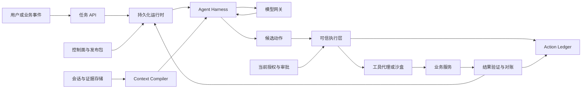

# 工业级 Agent 全景能力、工程约束与项目实施规格

**Master Capability & Engineering Specification**

版本：1.3 · 更新日期：2026-09-20 · 定位：生产工程与高阶 Agent 面试项目

这份规格面向需要调用工具、访问企业数据、执行多步任务并产生真实业务影响的 Agent。它保留规划、记忆、多 Agent、多模态与学习优化能力，同时定义权限、状态、执行一致性、恢复和验收边界。

**目标：让系统能够完成复杂任务，并使每次行动有授权、关键结果有证据、故障有处置路径、升级有回归依据。**

这是通用的能力规格和设计基线，不是某个行业认证，也不意味着所有模块必须一次性实现。落地时仍需补充具体业务规则、数据模型、接口和 SLO。能力域可以实现为模块，不等于必须按领域数量拆成微服务。

复杂度应由任务需要和评测收益决定。工作流、单 Agent 和多 Agent 都是可选实现方式。[工程参考：Building effective agents](https://www.anthropic.com/engineering/building-effective-agents)

## 本次扩展与阅读路径

原有第 1—16 章保留为能力与安全基线；新增第 17—24 章将其展开为架构、协议、上下文、仿真验证、自适应推理、数据、优化与部署方案。文末增加参考业务项目、技术路线、实验清单和面试证据要求。

**项目目标：完成一个可恢复、可评测、可运维的真实业务闭环，并围绕它实现有深度的高级能力。**允许广泛探索前沿方案；每项方案都要能回答适用问题、架构位置、失败边界、简单替代方案和验证方法。本文新增的具体架构是项目提案，尚不代表代码已实现或已通过生产验证。

建议先阅读“参考项目”和“面向高阶面试的交付深度与证据”，再阅读第十七章架构；实现时按前十六章约束和跨层动作契约逐项检查。

## 使用方式与优先级

- **P0：生产基础。**在相关业务能力开放生产流量之前必须满足；例如只读助手不必实现退款对账，但有外部写操作的系统必须定义副作用恢复协议。
- **P1：规模与效率。**随并发量、任务时长和业务复杂度建设。
- **P2：高级增强。**通过对照评测证明质量、效率或成本收益后启用。
- “必须”约束已经启用的能力；示例阈值不构成通用标准。成本、步数、内存、时延和可靠率须按业务测量设定。

## 全景能力矩阵

| 领域 | 核心责任 | 优先级 |
|---|---|---|
| 1. 业务契约与任务语义 | 明确目标、授权范围、成功证据和不变量 | P0 |
| 2. 身份、租户与委派授权 | 明确代表谁、能操作哪些资源 | P0 |
| 3. 模型网关与推理治理 | 管理模型能力、错误、降级和版本 | P0/P1 |
| 4. 认知、规划与停止控制 | 有界地分解、决策、执行与验证 | P0/P2 |
| 5. 知识检索与证据管理 | 获取有权限、有来源、有效的信息 | 相关场景 P0/P1 |
| 6. 上下文与记忆生命周期 | 保护关键状态，管理压缩、缓存和记忆 | P0/P1/P2 |
| 7. 工具契约与协议适配 | 将模型提议转换为受控工具请求 | P0 |
| 8. 副作用一致性与并发控制 | 防重复、守约束、处理未知结果 | 写操作 P0 |
| 9. 持久化运行时与恢复 | 管理调度、检查点、接管和版本恢复 | 长任务/写操作 P0 |
| 10. 人机协同与交互控制 | 澄清、审批、取消、接管和结果交付 | P0/P1 |
| 11. 沙盒、多模态与浏览器执行 | 安全处理代码、文件与 GUI 交互 | 相关场景 P0/P1 |
| 12. 安全、隐私与供应链治理 | 限制注入、数据外泄和依赖风险 | P0 |
| 13. 多 Agent 协作治理 | 管理委派、共享状态和独立验证 | P1/P2 |
| 14. 容量、成本与运行保障 | 管理负载、预算、故障和灾备 | P0/P1 |
| 15. 可观测性、审计与调试 | 关联行为、事实、费用和版本 | P0 |
| 16. 评测、发布与持续改进 | 以证据控制上线和后续优化 | P0/P2 |
| 17. 运行时架构与控制面 | 解耦 Harness、执行环境、发布包与状态权威 | P0/P1 |
| 18. 上下文编译、信息流与记忆实验 | 让上下文选择、失效和长期记忆可测量 | P1/P2 |
| 19. 协议互通与程序化工具执行 | MCP/A2A 接入、受控代码编排和批量动作 | 相关场景 P0/P1/P2 |
| 20. 执行回放、仿真与形式化验证 | 重现轨迹、注入故障、验证关键协议 | P1/P2 |
| 21. 自适应推理与计算分配 | 按质量、风险、时延和费用分配推理资源 | P2 |
| 22. 时态知识、语义层与检索路由 | 统一业务口径、时态、数据更新和检索策略 | P1/P2 |
| 23. Agent 优化与实验治理 | 受控优化策略，防污染并验证真实增益 | P1/P2 |
| 24. 交付、交互与推理基础设施 | 部署升级、异步交互、容量与可选推理服务 | P0/P1/P2 |

这些领域存在交叉调用，不是所有请求依次穿过的线性流水线。身份、安全、预算和观测应贯穿执行全过程。

## 一、业务契约与任务语义（Task Contract & Invariants）

**核心命题：明确“做什么、允许做什么、如何证明完成”，防止模型自行扩大目标或宣布成功。**

1. **结构化任务契约。**记录目标、业务对象、操作范围、交付物、约束、截止时间、费用预算及成功条件；保留原始要求与结构化解释的对应关系。
2. **意图识别与歧义澄清。**区分咨询、检索、起草、修改、提交和持续监控；对象不唯一、参数缺失或要求矛盾时，按影响程度澄清。
3. **业务不变量。**金额上限、库存非负、租户归属、合法状态迁移等约束由业务服务或数据库执行，不能只写在 Prompt 中。
4. **分离运行状态与任务结果。**运行状态可包含 QUEUED、RUNNING、WAITING、CANCELLING、TERMINATED；结果可包含 SUCCESS、PARTIAL_SUCCESS、FAILED、CANCELLED。等待原因独立记录，未结束时结果可为空。
5. **独立动作状态。**单个动作记录 NOT_SUBMITTED、PENDING、SUCCEEDED、FAILED、UNKNOWN；RECONCILING 描述恢复过程，不与 UNKNOWN 混为一个结果。
6. **范围与变更管理。**用户追加需求时，明确是补充约束、替换目标还是新增任务；影响审批、预算和依赖时生成新的任务或计划版本。
7. **产物与完成证据。**交付文件、变更记录、外部流水号、测试结果或有来源的结论；开放式研究任务使用明确质量量表，不能伪装成存在唯一客观答案。
8. **终止与遗留义务。**任务退出时说明已完成、未完成、已发生的副作用和未决动作；自动执行结束不等于对账义务结束，未决动作必须有持续负责者。

## 二、身份、租户与委派授权（Identity, Tenancy & Delegation）

**核心命题：每次执行都能说明“代表谁、基于什么授权、作用于哪个资源”。**

1. **可信身份上下文。**tenant_id、principal_id、agent_app_id、run_id 由认证和调度系统建立；模型提供的 ID 不能替代可信身份。
2. **资源级授权。**结合角色、资源属性和关系检查权限；允许调用退款工具，不代表允许操作任意订单。RBAC、ABAC、ReBAC 按业务选择。
3. **可验证委派。**记录委派主体、接收方、授权范围、用途、到期时间和撤销状态；使用可信服务端记录或受验证凭证承载，不能只靠 Trace 中的字符串链。
4. **权限单调收缩。**子任务权限不得超出父级授权、租户策略和任务必要范围的交集；新增权限走明确授权路径。
5. **凭证隔离。**使用凭证代理、工作负载身份或短期凭证，限制受众和用途；长期密钥不进入 Prompt、普通日志和产物。无法使用短期凭证时由受控适配器保管并轮换。
6. **执行时再授权。**派发工具前复核授权是否有效；资源条件在真正修改时由权威服务再次校验。权限撤销后阻止新动作并按策略处理已在途操作。
7. **全存储面租户隔离。**数据库、索引、记忆、对象存储、缓存、检查点和 Trace 都要落实访问边界；不能仅在模型输出阶段过滤。
8. **授权审计。**记录策略版本、授权依据、资源范围和结果；执行凭证失效与审计证据保留分别管理。

## 三、模型网关与推理治理（Model Gateway & Inference Governance）

**核心命题：模型是具有能力差异、随机性、成本和故障模式的外部依赖。**

1. **统一但不抹平语义的适配层。**归一消息、工具调用、结构化输出、流式事件和错误；保留各模型特有字段与能力限制，避免伪兼容。
2. **能力注册。**声明工具调用、结构化输出、多模态、上下文与输出限制；记录供应商、可用模型版本及数据处理边界。
3. **意图与难度路由。**按任务质量要求、时延和成本选择模型；低置信路由可升级处理，不把路由结果当作授权决定。
4. **超时、限流与有限重试。**统一 deadline、退避、抖动、Retry-After 和重试预算；避免网关、SDK、业务层重复重试放大负载。
5. **语义兼容降级。**备用模型须满足能力、评测和数据边界；记录切换原因。供应商的服务端工具可能产生副作用，重试也必须遵守动作协议。
6. **完整输出校验。**处理截断、拒答、非法 Schema 和缺失字段；流式参数收齐并通过校验后才能执行动作。部分输出不作为已批准业务指令。
7. **版本化与可归因。**记录模型标识、推理参数、Prompt、工具契约、适配器及价格版本；无法固定模型快照时明确可复现性限制。
8. **推理预算与输出质量。**按任务配置推理和输出预算；区分语法合法、事实正确、授权有效和业务可执行，任何单一结构化输出能力都不能替代后续检查。

## 四、认知、规划与停止控制（Cognition, Planning & Termination）

**核心命题：让模型灵活提出方案，让运行时约束执行边界并验证进展。**

1. **多范式执行。**支持固定工作流、单 Agent、Plan-and-Solve、局部 ReAct；根据任务可预测性选择，不强制所有任务先生成复杂 DAG。
2. **计划契约。**每个节点定义目标、输入输出、依赖、前置条件、完成证据、副作用与预算；模型生成的计划是候选，经过校验后才可执行。
3. **计划版本与依赖失效。**重规划后明确哪些节点仍有效、哪些证据过期；已执行副作用不会因删除计划节点而消失。
4. **事实、假设与待验证项分离。**保留来源与时效；模型自报置信度只是辅助信号，不能直接决定授权或真伪。
5. **结构化诊断与有限恢复。**区分参数、权限、业务冲突、依赖故障和结果未知；输出错误类别、证据、下一步与停止条件，限制修复和重规划次数。
6. **动态示例与过程知识。**检索经过验证、权限兼容、版本适配的示例和操作手册；不携带历史凭证、一次性授权或测试集答案。
7. **进展检测与终止。**结合目标差距、新证据、相似动作、耗时及预算判断是否继续；必要的状态轮询不应仅因动作相似而误判死循环。
8. **完成验证与受控自改进。**使用测试、规则、业务查询或评审验证结果；自我审查不构成独立证明，Prompt/工具/策略自修改只能在受控分支评测后发布。

## 五、知识检索与证据管理（Retrieval & Evidence）

**核心命题：关键决策依赖可追溯、可访问、仍然有效的证据。**

1. **数据接入与更新。**支持文档、网页、数据库和业务接口；管理解析、OCR、分块、去重、增量更新、删除传播和索引版本。
2. **权限感知检索。**在候选召回阶段执行租户和资源权限约束，输出前必要时复核；禁止先将越权数据送给模型再要求它隐藏。
3. **多路检索与重排序。**按场景组合关键词、向量、结构化查询和图检索；GraphRAG 是可选能力，须证明收益。
4. **查询规划。**支持改写、拆分、多跳查询、结果聚合和覆盖检查；限制检索递归、数据量与执行成本。
5. **证据来源与时效。**保存来源 URI/资源 ID、版本、原文位置、采集时间、生效区间和权限标签；动态事实在执行前按需要重新查询。
6. **冲突与缺失处理。**区分已发布制度、旧版政策、草稿和非权威意见；无法解决的冲突显式呈现，证据不足时允许拒绝定论或升级人工。
7. **结论—证据关联。**关键结论对应具体证据，并区分引用事实、推导和建议；对引用是否支持结论进行抽查或评测。
8. **独立检索评测。**分别测召回、排序、权限过滤、时效和最终回答质量；防止把检索故障错误归因于模型能力。

## 六、上下文与记忆生命周期（Context & Memory Lifecycle）

**核心命题：模型上下文可以压缩，权威业务状态必须保持准确、可恢复。**

1. **分层记忆。**区分工作状态、会话历史、情景案例、长期偏好和程序性知识；业务数据库仍是业务事实的权威来源。
2. **上下文预算与装配。**为系统约束、当前任务、证据、工具结果和输出预留预算；根据相关性、时效和来源优先级装配，保留消息及工具响应的协议完整性。
3. **关键实体强保护。**ID、金额、币种、单位、权限范围、未决动作存入类型明确的状态；摘要引用这些字段，不能依赖模型承诺“不丢失、不四舍五入”。
4. **压缩、裁剪与回取。**摘要保留目标、约束、重要决定和未完成事项；原始材料以有权限的引用保存，必要时重新读取并验证摘要保真度。
5. **缓存与工具联合优化。**稳定可复用前缀；根据厂商能力使用延迟加载、动态注册或受控工具调度入口。单纯把工具说明写入消息不等于完成原生工具注册。
6. **记忆写入与来源。**记录来源、时间、适用范围、验证状态和失效规则；确定性校验负责格式、权限与可验证规则，不能普遍证明自然语言事实为真。
7. **冲突、过期、纠错与删除。**支持版本更新、TTL、用户更正、撤回及索引/缓存失效；备份和审计保留按明确策略处理，避免许诺即时删除所有副本。
8. **偏好与授权隔离。**长期偏好不能成为持续授权；历史案例不能授予新权限。语义结果缓存按租户、权限、版本和时效隔离，高风险动作不得直接以相似缓存结果触发执行。

缓存命中率、缓存 Token 价格折扣和总任务成本降幅应分别测量，不预设 80% 或 90% 收益。Claude 的工具搜索提供具体的延迟加载协议，其他供应商需分别核实。[实现参考：Tool search](https://platform.claude.com/docs/en/agents-and-tools/tool-use/tool-search-tool)

## 七、工具契约与协议适配（Tool Fabric & Contracts）

**核心命题：每个工具都是带权限、状态和错误语义的业务适配器。**

1. **接入与生命周期。**支持按需采用 MCP、OpenAPI、SDK 或内部 RPC；管理工具注册、版本、健康检查、弃用和下线。协议支持不等于业务安全已完成。
2. **输入输出契约。**定义类型、范围、枚举、单位、币种、时间与时区、分页、空值和大小限制；金额和长整数 ID 采用明确的精度与传输约定。
3. **无损参数处理。**仅允许 Schema 明确规定且无歧义的转换；保留原始值和规范化值。金额、编号和长整数不进行未经契约允许的隐式转换。
4. **副作用契约。**声明读写范围、幂等机制及期限、可查询结果、异步行为、补偿条件、数据出站和审批策略；将回滚、撤销、补偿分别描述。
5. **错误语义。**结构化输出错误类别、是否可能已经执行、是否可重试、建议等待时间、关联动作 ID；不单凭 HTTP 状态码决定业务恢复。
6. **授权后的工具发现。**先按用户和任务授权筛选，再按相关性暴露；参数中的目标资源仍需执行时鉴权。工具返回文本按不可信内容处理。
7. **受控执行。**实施调用前校验、并发/超时限制、输出截断与有权限的产物引用；并行写操作需声明冲突范围，不能仅因模型一次返回多个调用就并行执行。
8. **契约测试与行为核验。**测试 Schema、权限、幂等、错误码、版本兼容和副作用；工具自述 readonly/idempotent 只能作元数据，不能代替服务端强制机制。

MCP 明确要求谨慎对待来自不可信服务器的工具 annotations。[协议参考：MCP Tools](https://modelcontextprotocol.io/specification/2025-06-18/server/tools)

## 八、外部副作用一致性与并发控制（Side-Effect Consistency）

**核心命题：重复请求、崩溃、超时和并发不能被模型“猜测处理”。**

1. **稳定的业务动作身份。**首次派发前持久化 operation_id；同一动作的重试、恢复和接管复用它，新的合法动作使用新 ID。不能以模型生成的意图文字作为可靠唯一身份。
2. **服务端幂等与参数冲突。**对 tenant_id + operation_id 建立受控去重；相同 ID 不同规范化参数摘要应报冲突。定义并发处理中请求、结果复用、记录期限和过期行为。
3. **业务不变量原子执行。**在业务服务事务内实现合法状态迁移、唯一约束、条件更新和金额/库存限制；检查影响行数，版本冲突后重读并重新判断，不能只把版本号更新后再提交。
4. **分布式副作用保证边界。**本地幂等表和 Redis 锁无法独自保证第三方只执行一次；必须依据外部幂等、唯一业务编号或权威查询能力设计协议。不支持时降级到受控人工处理或拒绝自动执行。
5. **UNKNOWN 对账。**请求可能已提交而结果不明时进入 UNKNOWN，保存请求身份并执行查询、回调确认或符合外部契约的原键重试。最终一致查询的“未找到”不能直接证明未执行。
6. **本地事务与消息一致性。**按场景使用事务 Outbox、Inbox/消费去重；记录事件序号和版本，处理重复消息、乱序回调及迟到成功结果。Outbox 不保证第三方副作用只发生一次。
7. **补偿与人工处置。**Saga 补偿定义前置条件、幂等性和失败恢复；不能撤销已被读取的邮件等事实。对账超时后升级人工，但仍持续接收迟到结果并维护未决义务。
8. **并发、租约与隔离。**按业务选择乐观锁、行锁或串行化队列，结合索引和隔离级别分析锁范围；租约接管使用可被写入端验证的 fencing/version 机制拒绝旧执行者。远程调用、模型推理和人工等待期间不长期持有数据库事务锁。

幂等键必须由执行端真正兑现；同一 operation_id 防请求重放，业务唯一约束还需防跨任务重复。第三方的幂等记录过期后，旧键重试也可能不再安全。[实现参考：Stripe Idempotent requests](https://docs.stripe.com/api/idempotent_requests)

## 九、持久化编排、调度与恢复（Durable Runtime & Recovery）

**核心命题：任务跨进程、跨时间继续执行时，知道从哪里恢复、哪些动作不能盲目重做。**

1. **显式执行状态机。**支持顺序、条件分支、并行汇合、循环、定时器和外部事件；定义节点输入、状态合并及异常转移。
2. **检查点与持久化策略。**规定快照边界、增量写入、提交确认和清理策略；区分 Checkpoint、节点结果和事件日志。使用事件溯源时单独定义事件 Schema、顺序和投影重建。
3. **任务级身份。**区分 task_id、run_id、step_id、attempt_id 和 operation_id；重试可以改变 attempt_id，但不能因此改变同一业务动作身份。
4. **Worker 调度与接管。**支持持久化队列、心跳、租约、重投递和失效执行者隔离；防止扩缩容与网络分区造成双执行者同时提交。
5. **明确恢复语义。**已完成且已持久化的步骤读取历史结果；允许重算的步骤重新执行；副作用状态不明的步骤进入对账。快照不能消除外部成功、本地落库前崩溃的窗口。
6. **取消、超时和关闭。**取消信号传播到子任务和本地执行器；在派发前检查取消状态，跟踪已在途外部操作。停止 Worker 不代表外部操作已取消。
7. **安全回放与分叉。**区分记录查看、录制结果回放、模拟环境重跑及新分支执行。缺少录制结果时不得静默调用生产写工具；新分支需隔离数据库、凭证、队列和网络出口。
8. **版本恢复与迁移。**运行中任务绑定工作流、状态 Schema 和工具版本；升级时选择旧版本继续运行、显式迁移或安全终止。模型和环境非确定性意味着重跑不保证逐字复现。

LangGraph 的完整快照在 superstep 边界形成，节点级 pending writes 用于恢复，二者并非同一机制；具体持久化保证应按采用的框架版本验证。[框架参考：Checkpointers](https://docs.langchain.com/oss/python/langgraph/checkpointers)

## 十、人机协同、审批与交互（HITL & User Control）

**核心命题：用户能理解进展、授权具体动作、随时介入，并准确知道已经发生了什么。**

1. **澄清与任务确认。**仅对影响执行正确性、授权或成本的重要歧义提问；已明确授权的范围内不重复打断。
2. **审批策略。**按风险、金额、数据敏感度、可逆性及目标范围决定审批要求；支持租户已有授权策略、单次审批、批量有限授权和必要的多人审批。
3. **具体审批对象。**绑定租户、主体、operation_id、资源、动作、规范化关键参数摘要、有效期及使用约束；参数改变不得继承旧审批。
4. **TOCTOU 防御。**执行时重新鉴权，业务条件在权威服务的事务或条件更新中检查；人工审批不能替代提交时约束。仅影响审批依据的变化要求重新确认。
5. **异步恢复安全。**Webhook 验签、事件去重、防重放、过期校验和并发审批裁决；重复点击批准不能生成新的业务动作。
6. **人工接管包。**提供当前目标、关键证据、已执行操作、未决结果、风险和可选路径；移交执行权时限制自动 Worker 继续写入。
7. **用户取消与中途修改。**说明能停止哪些步骤、哪些操作已经提交；先确认外部结果再决定补偿，不把取消按钮等同于事务回滚。
8. **诚实进度与结果交付。**区分“计划执行、正在执行、已提交、已确认”；流式输出不提前宣布成功。交付结果包含证据、剩余事项和必要的不确定性。

## 十一、沙盒、多模态与浏览器执行（Sandbox, Multimodal & Computer Use）

**核心命题：代码、文件和 GUI 操作拥有与其风险匹配的隔离与验证机制。**

1. **分级执行环境。**按任务威胁模型选择受限进程、容器或 MicroVM；环境、镜像和依赖可追溯，多租户之间隔离。
2. **最小资源与系统权限。**限制 CPU、内存、进程数、磁盘、运行时间、系统能力和系统调用；不挂载宿主 Docker socket。只读根文件系统与受控可写临时目录分开配置。
3. **文件与秘密隔离。**输入只读挂载、输出写入指定目录；防路径穿越和符号链接逃逸，限制解压体积。秘密由执行代理按需提供，不因能运行代码就默认可读全部环境变量。
4. **网络出口与 SSRF 防御。**按目的地和协议授权，校验 DNS 解析与重定向后的目标；考虑 loopback、私网、链路本地、IPv6 和云元数据。确需访问内部服务时通过明确授权的适配器。
5. **安全数据分析。**Python/SQL/Bash 工具使用不同权限配置；SQL 默认只读身份、限制结果量和超时，避免把生成 SQL 直接交给高权限账户。
6. **浏览器语义交互。**支持 DOM、无障碍树和视觉定位；页面变化后重新定位，校验目标账户、对象、金额和域名，限制下载、弹窗和跨域跳转。
7. **多模态证据。**OCR、图片、音频和视频提取保留位置或时间戳与不确定性；媒体中识别出的文字仍是外部数据，不自动成为控制指令。
8. **动作后验证与产物管理。**验证业务记录或权威回执，不能只以点击事件或页面提示判成功；产物有 owner、版本、摘要、权限和保留期，危险格式按需扫描后交付。

## 十二、安全、隐私与供应链治理（Security, Privacy & Supply Chain）

**核心命题：模型即使误解或受到诱导，也不能自行扩大权限和执行范围。**

1. **信任边界。**区分系统策略、用户授权与外部材料；网页、工具响应、记忆、检索案例及子 Agent 输出不能授予权限。
2. **注入纵深防御。**结合输入处理、结构化隔离、攻击检测、受控工具和输出审查；XML 标记与正则是辅助手段，不是执行安全边界。
3. **模型外策略执行。**所有副作用入口经过可信执行层；批量操作、通用 execute 工具、脚本和子 Agent 不能成为绕过路径。
4. **数据最小化与隐私。**按任务用途控制发送字段、供应商和存储位置；支持必要的脱敏/可控令牌化，限制脱敏映射访问，避免脱敏破坏业务含义。
5. **秘密与输出防泄漏。**分别控制工具参数、URL、文件、模型回复和日志中的数据出站；凭证轮换、吊销与泄漏响应有明确流程。
6. **依赖与插件治理。**工具服务器、Skill、Prompt 模板、容器镜像和依赖来源可验证、版本固定、最小授权；新增或更新后重新评估权限与行为。
7. **安全测试与事件处置。**覆盖间接注入、工具投毒、越权、数据外传、恶意附件和供应链变更；告警后支持隔离任务、撤销凭证和取证。
8. **独立紧急停用。**可以停用单个工具、租户、模型或动作类型；开关在执行层生效。保留授权范围内的对账与清理通道，避免停用造成未决副作用失管。

提示词注入不能仅靠文本清洗解决，工程控制需限制受攻击后的行动范围。[安全参考：OWASP Prompt Injection Prevention](https://cheatsheetseries.owasp.org/cheatsheets/LLM_Prompt_Injection_Prevention_Cheat_Sheet.html)

## 十三、多 Agent 协作与组织治理（Multi-Agent Governance）

**核心命题：通过可验证的分工获得收益，同时控制协调成本、权限和共享状态。**

1. **按收益选用拓扑。**支持主管—执行者、并行专家、生成—验证和受控交接；对照单 Agent 基线测量质量、时延和成本。
2. **派工契约。**定义子任务目标、输入、产物、验收、权限、预算和截止时间；主管是否挂载执行工具由责任边界决定，不作统一禁止。
3. **最小委派与凭证隔离。**每个子 Agent 只拿必要权限和数据；禁止将父任务全部凭证与上下文默认复制。
4. **共享状态与冲突裁决。**优先让任务产出独立 Artifact；共享资源写入经过统一动作协议，定义谁拥有写权限及如何处理冲突。
5. **结构化交接。**移交目标、约束、证据引用、已执行动作、未决结果和产物；避免灌入完整探索历史，但允许有权限地回取关键原始证据。
6. **独立验证。**可客观验证的任务优先使用测试、业务规则或外部事实；开放式结果采用量表与人工校准。不同模型或不同 Prompt 不自动意味着错误独立。
7. **生命周期与资源控制。**限制总并发、最大委派深度和循环派工；继承 deadline、取消和预算，处理子 Agent 失败及父任务退出后的遗留动作。
8. **协作评测。**测量任务重复、遗漏、交接信息丢失、冲突、协调成本和结论一致性；不能只比较最后回答是否更长。

## 十四、容量、成本与运行保障（Capacity, Cost & SRE）

**核心命题：在高负载、预算紧张或依赖故障时，系统仍有可预测的服务行为。**

1. **准入与背压。**采用有界队列、最大并发、负载拒绝和可解释排队；不可无限堆积待执行任务。
2. **多租户公平性。**按租户、用户和业务线设置并发与速率配额，控制大任务对其他请求的影响。
3. **端到端 deadline。**模型、检索、工具、重试和子任务共享时间预算；排队等待也计入用户时限，人工等待采用独立、可持久化的到期策略。
4. **费用预占与结算。**并发调用前预占可执行上限对应预算，完成后结算；记录模型、搜索、浏览器、沙盒和存储等成本。供应商计费延迟及不可中断工作带来的误差须明确。
5. **故障隔离与降级。**对依赖设置独立资源池、熔断和重试预算；降级为只读、草稿或人工处理时向用户准确说明，不能静默降低关键安全保证。
6. **弹性与容量规划。**依据排队时延、并发执行数、供应商配额和数据库容量扩缩容；保证扩容不会同时放大下游负载与预算超支。
7. **服务目标与运维责任。**定义任务成功率、P95/P99 时延、UNKNOWN 最长处置时间、恢复时长和人工接管 SLA；有告警负责人、值班手册与演练。
8. **备份和灾难恢复。**明确 RPO/RTO、备份加密与恢复验证；恢复后使用持久化业务动作记录和外部状态对账，防旧任务重复产生副作用。

## 十五、可观测性、审计与调试（Observability & Audit）

**核心命题：能解释发生了什么、依据是什么、成本是多少，以及应如何处理。**

1. **全链路关联。**关联任务、运行、步骤、尝试、业务动作、审批、工具调用和外部流水；标识不代替授权，Trace ID 不代替业务幂等键。
2. **标准遥测适配。**按选定版本接入 OTel、GenAI 语义约定或 OpenInference；记录模型调用、工具活动和异步关联，多 Agent 并发可用 Span Links 等机制表达。
3. **可获得的执行证据。**记录输入摘要、输出、工具参数与结果、决策摘要和状态变化；不声称能捕获不可访问的完整内部推理。
4. **费用与性能归因。**区分输入、输出、可获取的推理 Token、缓存读写、排队与工具耗时；标明估算和账单实际值，按租户与业务聚合。
5. **上下文差分与版本。**记录加入/删除/压缩了哪些材料及来源版本；诊断信息丢失、过期证据和 Prompt/工具变化造成的回归。
6. **业务指标。**统计目标达成、错误动作、重复副作用、权限拒绝、对账积压、人工接管和每个成功任务成本；避免只优化请求成功率。
7. **审计与日志分治。**调试日志可按策略采样，关键授权和业务审计按要求保留；对高风险动作明确审计不可用时是否阻断，控制敏感数据及访问权限。
8. **受控复现。**将失败记录导出为去敏调试包，保留版本、输入、初始状态与录制结果；数据缺失或环境变化时标明复现限制，不静默连接生产补齐。

### 本项目选型：Langfuse（planned）

已确定直接在 Python Harness/模型网关中接入 Langfuse，提供 LLM 追踪、提示词管理、评分、数据集与对照实验；不要求先引入 LangGraph。OTel/Prometheus 保留运行监控，Temporal 负责恢复，动作账本和权威回执负责业务事实。当前只有本地受限 OTel 导出，Langfuse SDK、部署与联调尚待实现。

任务按 session 关联，执行段按 trace 记录，模型 generation 区分真实请求与持久化结果复用。优先关联上下文版本、检索选择、模型 usage、修复验证及停止原因，支持具体失败归因。导出有界异步、出站内容按来源策略去敏，租户/环境采用独立项目和凭证隔离；平台故障不导致业务重试。完整数据与故障契约见 [Langfuse 接入方案](docs/langfuse.md)。

## 十六、评测、发布与持续改进（Evaluation, Release & Learning）

**核心命题：能力提升和上线决策以可复核的证据为依据。**

1. **分层评测。**建立工具契约、授权、检索、压缩、规划、单任务和端到端评测；保留简单基线用于判断新增复杂度的价值。
2. **多维判定。**同时检查终态、授权与安全轨迹、额外副作用、结果沟通、费用和耗时；开放式任务使用明确量表及人工校准，不能只看数据库差分。
3. **隔离测试环境。**每次试验重置数据、文件和记忆，固定版本并记录时间、随机性与外部响应；隔离账号、出口与异步队列，防测试触发真实写操作。
4. **可靠率统计。**区分 pass@k 与 pass^k；按任务重复试验、计算估计值与置信区间，报告样本量、分层结果和任务权重。安全违规单独阻断，不能用高平均分抵消。
5. **故障、并发与攻击评测。**覆盖提交前后崩溃、响应丢失、重复乱序回调、租约失效、审批过期、权限撤销、提示词注入、预算并发和恢复后重放。
6. **发布与回滚。**绑定代码、模型、Prompt、工具契约、策略、索引和评测集版本；灰度按风险逐步开放。影子执行隔离副作用，代码回滚不自动撤销历史业务操作。
7. **生产故障转候选用例。**对失败轨迹去敏、去重并重建初始条件，经归因、参考结果核验和负责人审核后入库；将训练、Few-shot、优化集与保留测试集隔离。
8. **高级学习优化。**按需要采用 SFT、DPO、强化学习或 Prompt 优化。SFT 使用已验证示范，DPO 需要有依据的偏好对，强化学习需可靠奖励与受限环境；任何更新通过独立评测和发布流程。

本项目以 Langfuse 组织“失败轨迹 → 核验标注 → 开发数据集 → 策略对照 → 发布判断”的改进闭环。先完成单轮/多轮调查、检索策略、带验证反馈/独立多候选修复三组实验，比较质量、费用和时延；随后复用该底座评测路由、多 Agent 与记忆。正式报告保留冻结的本地数据与逐案例原始证据，LLM judge 经人工校准，缺失评分不能视为通过。

提示词在构建时从 Langfuse 解析为明确版本和本地快照，随版本化 AgentRelease 固定；运行时不追随可移动标签。现有 v1 清单需要兼容扩展，旧任务继续使用旧发布。平台分数不能直接触发业务执行或发布。LF-01—LF-04 分别交付追踪、实验、提示词固定和效果门禁，接入验收要求至少一次完整改进记录，而非仅证明数据已上传。

对于某个任务，执行 n 次、成功 c 次，在各次试验独立同分布且 n ≥ k 时：

\[
\widehat{pass^k}=\frac{\binom{c}{k}}{\binom{n}{k}},\qquad
\widehat{pass@k}=1-\frac{\binom{n-c}{k}}{\binom{n}{k}}
\]

组合数在可选元素不足 k 时取零。先按任务计算，再依据事先规定的权重汇总。不能把全体平均成功率取 k 次方作为总体 pass^k；小样本全通过也不证明真实成功率为 100%。[指标来源：τ-bench](https://arxiv.org/html/2406.12045v1)

代码、模型和人工评判应按任务组合；评测从需求和最初版本开始建立。[评测参考：Demystifying evals for AI agents](https://www.anthropic.com/engineering/demystifying-evals-for-ai-agents)

## 十七、运行时架构与控制面（Agent Harness & Control Plane）

**核心命题：让模型、执行循环、持久化状态与执行环境能够独立演进，并明确每份状态由谁负责。P0/P1。**

以下为本项目的设计提案；引用用于解释相关技术机制，不表示外部项目已经实现本文全部保证。

1. **四类边界。**控制面管理租户、策略、工具目录和发布版本；运行面负责调度、模型调用和工具派发；数据面保存业务事实、事件和产物；评测面使用隔离的账号、数据与执行环境。初期允许模块共进程，沙盒执行与秘密管理必须按威胁模型隔离。
2. **Harness 可替换。**将 Agent 循环定义为读取观察、装配上下文、提出动作、校验执行、消费结果和停止的接口；ReAct、规划器和多 Agent 主管都是可替换策略。模型 SDK 类型不得扩散到业务领域对象。
3. **推理与执行解耦。**模型和规划器产生 `ActionProposal`；只有可信 `ActionExecutor` 能提交外部写操作。沙盒不持有控制面管理凭证，工具代理按可信会话上下文代取最小权限凭证。
4. **发布包与紧急策略分离。**不可变 `AgentRelease` 绑定代码、Prompt、模型配置、工具 Schema、Context Policy、工作流与评测报告；每次运行固定发布包。权限撤销、紧急停用和更严格的出站限制实时生效，不能因为版本固定而继续使用过期授权。
5. **单一恢复权威。**本项目默认使用 Temporal 管理长任务、等待和恢复；模型调用、检索和工具 I/O 放入 Activity。Agent 策略初期使用显式 Python 循环；如引入 LangGraph，只负责局部决策图，并在 ADR 中约定检查点边界，不能让两个引擎各自重放同一个写动作。
6. **确定性与非确定性边界。**工作流回放消费已经记录的 Activity 结果，不重新请求模型来“复原”历史决策。未记录完成的 Activity 仍可能重复执行，因此写 Activity 必须使用第八章的动作协议；LLM 重试也需纳入重复计费预算。
7. **事件契约。**持久事件包含 `event_id`、聚合根 ID、聚合内序号、事件版本、因果 ID、关联 ID、发生时间与记录时间；只承诺明确范围内的顺序，不假设全局时钟全序。消费者处理重复、缺口和投影重建。
8. **恢复与保留期。**Session 事件流保存可回取历史，模型上下文只是其受控视图；大文件放对象存储。历史归档、工作流历史轮换和删除策略必须保留活跃任务与未决动作所需证据，事件“追加写”不等于敏感内容永不删除。

| 状态 | 权威来源 | 其他层如何使用 |
|---|---|---|
| 业务金额、订单状态、库存 | 业务数据库或外部权威服务 | 执行前读取，提交时原子校验 |
| 调度进度、定时器、等待事件 | 持久化工作流历史 | API 状态页是可重建投影 |
| 动作身份、提交意图、确认结果 | Action Ledger + 外部回执 | 重试与恢复复用身份；冲突进入对账 |
| 当前授权、撤销与紧急开关 | 授权和策略服务 | 缓存有明确时限，高风险动作执行时复核 |
| 会话事件与交付文件 | Session Store / Artifact Store | Context Compiler 按权限读取 |
| 调试 Trace、搜索索引、UI 进度 | 派生数据 | 不作为批准写入或确认成功的唯一依据 |

**验收：**分别终止 Harness Worker 和沙盒，任务可恢复且不增加业务副作用；替换模型适配器不修改业务动作协议；旧发布包运行期间撤销权限，新派发被拒绝。

Session、Harness、Sandbox 解耦可参考 [Anthropic Managed Agents 架构](https://www.anthropic.com/engineering/managed-agents)；工作流回放机制参考 [Temporal Workflow Execution](https://docs.temporal.io/workflow-execution)。这里采用的是架构思路，不要求采购托管产品。

## 十八、上下文编译、信息流与记忆实验（Context Compiler & Memory）

**核心命题：让“给模型看什么”成为可以测试、追踪和优化的工程模块。P1；自适应记忆 P2。**

1. **编译流水线。**输入任务契约、当前状态、授权范围和证据引用；执行权限过滤、版本检查、相关性选择、去重、预算分配、必要压缩及供应商格式适配；输出 `ContextBundle`、材料清单、Token 估计和丢弃原因。预算包含工具 Schema、多模态材料与输出预留。
2. **依赖与失效图。**建立 `claim → evidence → source_version`、`plan_step → claim` 和 `approval → action_digest` 关联；来源更新、撤销或资源变更后标记受影响内容并重新验证。自然语言依赖不能保证完全抽取，高风险决策额外显式声明依赖。
3. **渐进加载。**先加载工具和过程知识的目录、摘要与引用，选中后再加载详细契约或正文；加载前检查权限和版本。业务关键字段来自类型化状态，不能以目录摘要代替。
4. **信息流标签。**材料携带租户、敏感等级、用途、来源可信度及允许出站目标；确定性转换传播标签，混合内容采用保守合并。LLM 生成内容无法可靠逐字追踪污染传播，因此按其读取的敏感输入保守约束输出目的地，降密需可信规则或人工决定。
5. **记忆整合流水线。**事件先成为候选记忆，经过归因、冲突检查和必要核验后进入可检索版本；用户偏好、观察事实、模型推断和操作手册分别存储。召回频率、模型自信和用户点击不能单独证明事实正确。
6. **时间与纠错。**对易变事实记录业务有效时间与系统获知时间；区分“当时有效的规则”与“当前认为历史上有效的规则”。错误记忆撤回后失效关联缓存，保存必要的纠错依据。
7. **长期收益实验。**比较无长期记忆、仅情景检索、情景加语义整合三种配置；按用户或任务族隔离数据，测重复任务收益、错误记忆放大、跨租户泄漏和删除传播时延。跨会话任务按实际时间顺序评测，避免未来信息泄漏。
8. **长上下文替代方案。**对比直接长上下文、RAG、摘要压缩和受控程序切片；程序读取仅访问授权产物，禁止绕过工具代理。记录压缩恢复后约束丢失率和任务成功率，不只比较 Token 节约。

**验收：**可回答任意一次调用“每段上下文来自哪里、为什么被选中、使用什么版本”；政策更新、权限撤销和记忆纠错均能触发相关材料失效；上下文耗尽时仍可恢复未决动作。

按需回取与长任务上下文管理参考 [Effective context engineering](https://www.anthropic.com/engineering/effective-context-engineering-for-ai-agents)；Context Compiler、依赖图及信息流规则是本项目拟实现的机制。

## 十九、协议互通与程序化工具执行（MCP, A2A & Programmatic Tools）

**核心命题：协议负责互通，执行层负责授权与业务语义。MCP 接入按需 P0/P1；跨系统 Agent 协作 P2。**

1. **三类契约分开。**MCP 用于工具及上下文接入；A2A 用于独立 Agent 服务之间的任务、消息和产物交互；Skill/Playbook 是版本化过程知识与资源包。它们都不能替代业务服务的授权、幂等和结果核验。
2. **协议兼容矩阵。**固定实际采用的协议与 SDK 版本，记录传输方式、认证方式、任务能力、流式能力、取消语义和扩展支持。能力声明只决定如何调用，不证明远端可信或完成了业务动作。
3. **MCP 安全接入。**验证 Token 的目标受众和授权范围，禁止将收到的 Token 不加校验地透传到下游；区分 MCP 会话标识与身份。动态工具列表发生变更后重新校验工具来源、Schema、权限和评测兼容性。
4. **A2A 边界适配。**远端任务 ID 映射到本地 task/run，产物作为带来源的外部证据；远端任务状态与本地业务动作结果分别记录。远端宣布完成仍需验证交付物，取消请求被接收也不代表副作用已撤销。
5. **远端委派控制。**Agent Card、能力列表和发现服务使用来源校验及允许名单；认证方案在本地可信配置中约束。委派传递用途、预算和截止时间；本地无法强制远端预算时，只能声明本地调用限制与远端契约保证。
6. **程序化工具调用。**允许模型生成代码，在沙盒中完成批量查询、分页、过滤与聚合，只把相关结果送回模型；所有受控工具仍逐次经过统一执行入口。脚本中的循环、并发和递归共同消耗任务预算。
7. **批量写操作。**明确批次与单项动作身份，逐项记录结果、失败和 UNKNOWN；批次超时后不能重新生成整个批次。审批覆盖明确的资源集合、参数和数量上限，不能把“运行这个脚本”视为无限授权。
8. **协议网关故障。**流断开、回调重复、远端重启和能力升级都需契约测试；服务端未知结果不能因客户端更换连接而变成新动作。

**验收：**至少一个 MCP 工具适配器和一个模拟远端 Agent 完成同一业务链路；注入 Token 受众错误、工具描述投毒、断流和重复回调，仍保持权限与动作身份不变量。

协议参考固定为 [MCP 安全实践（2025-11-25）](https://modelcontextprotocol.io/docs/2025-11-25/tutorials/security/security_best_practices) 与 [A2A v0.3.0](https://a2a-protocol.org/v0.3.0/specification/)，不声称它们是最新版本；程序化调用思路参考 [Advanced tool use](https://www.anthropic.com/engineering/advanced-tool-use)。实际实现须先做版本兼容验证。

## 二十、执行回放、仿真与形式化验证（Replay, Simulation & Model Checking）

**核心命题：让难复现的时序故障变成可重复验证的工程资产。P1；形式化建模 P2。**

1. **执行录制包。**记录脱敏初始状态、任务与发布版本、ContextBundle 清单、模型可见输入输出、工具请求响应、审批事件、逻辑时钟和外部状态快照引用；标记未记录字段。真实凭证不随包导出。
2. **三种运行模式。**`replay` 只消费录制响应、验证状态迁移；`simulation` 对独立仿真环境实际执行；`live` 经过生产授权链。模式由可信运行配置锁定，禁止模型切换模式或在录制缺失时自动访问生产。
3. **分叉实验。**从检查点创建独立任务及动作命名空间，比较不同规划器、模型和上下文策略；继承证据时重新检查访问权限，不继承生产写凭证或一次性审批。
4. **轨迹偏离处理。**录制响应按调用身份和请求摘要匹配，不能按“第几个工具调用”机械复用。候选策略发出不同动作时报告回放分歧，并转独立仿真评测；历史轨迹不能完整估计另一策略的反事实效果。
5. **环境仿真。**业务服务替身支持可配置的提交成功后断连、查询滞后、回调乱序、限流、租约过期和权限撤销；状态转移由业务规则驱动。模拟用户用于规模测试，关键业务真值不完全交给另一个 LLM 生成。
6. **状态机性质测试。**随机生成提交、重试、取消、超时、接管、回调和恢复序列；在每一步检查不变量，并将失败序列缩减为可复现用例。对复杂函数添加变形测试，例如单位等价转换不应改变合法业务结果。
7. **有限状态模型。**使用 TLA+/PlusCal 对“两个 Worker + 一个外部动作 + 审批撤销”建模；检查旧租约不能提交受控写入、成功不能被迟到失败覆盖、同一合法动作不会增加净副作用等性质。显式建模外部幂等假设，不能用假设预先写入待证明结论。
8. **安全性与活性分开。**持续网络分区下可以保持不重复执行，但不保证最终确认。只有在依赖最终恢复、公平调度等假设成立时检查活性；第三方永远不提供证据时允许保持 UNKNOWN 并承担人工处置义务。

**验收：**提供模型检查配置、状态空间边界、找到过的反例及对应修复；至少一个反例转为实际数据库/工具适配器的故障测试。有限模型通过不等于整个 Python 实现获得形式化证明。

工具能力参考 [TLC Model Checker](https://docs.tlapl.us/using%3Atlc%3Astart)。形式化验证优先聚焦动作协议这一小块高价值边界。

## 二十一、自适应推理与计算分配（Metacontrol & Test-Time Compute）

**核心命题：依据可测量的边际收益，决定继续检索、加深推理、调用专家还是停止。P2。**

1. **元控制器。**输入任务类别、剩余时间和预算、证据缺口、依赖健康及历史校准信号，输出下一种执行策略；初期用规则和离线选择表，积累数据后再评估学习路由。
2. **策略阶梯。**依次比较固定工作流、单 Agent、按需规划、并行只读专家和生成—验证；每一层记录升级触发条件、可回退路径与额外成本。多 Agent 只分配可以独立验收或提供独立证据的子任务。
3. **Value of Information。**把额外检索或验证视为有成本的动作，估计它是否可能改变当前决策；该估计用于效率排序，不能让模型以“收益低”为理由跳过强制授权和业务核验。
4. **选择性回答与校准。**在保留集测量置信信号对应的实际正确率，以及 risk–coverage 曲线；允许证据不足时澄清、拒绝定论或转人工。只有概率含义明确的信号才报告 Brier Score/ECE 等校准指标。
5. **Best-of-N 与验证器。**对纯推理、只读研究或隔离环境中的候选方案进行多样采样；验证器使用外部事实、规则或测试，记录错误相关性与选择偏差。不能在真实写系统里执行 N 个候选再挑最优结果。
6. **搜索式规划。**Tree Search/MCTS 仅在具有可执行状态转移模型和可检验奖励的仿真任务中启用；学习得到的世界模型可能出错，预测结果不能充当生产成功回执。
7. **投机执行。**只对获准的只读、可丢弃计算做推测性并行；并发也需预算预占。真实外部写操作必须等依赖、授权与审批齐备，不因预测用户可能批准而提前提交。
8. **策略评测。**固定任务分层与预算，报告成功率、错误动作率、P95 完成时延和每个成功任务成本的 Pareto 前沿；保留被拒绝任务与超时任务，防止路由器通过只接简单任务提高表面成功率。

**验收：**至少一个任务族证明自适应策略相对固定策略有收益，并公开无收益或退化的任务族；每条升级规则可回溯，安全检查无可被学习策略关闭的入口。

## 二十二、时态知识、语义层与检索路由（Temporal Knowledge & Semantic Layer）

**核心命题：解决企业数据中“口径不同、时间不同、权限不同”的事实冲突。P1；图检索 P2。**

1. **结构化语义层。**为订单、付款、库存等业务对象定义指标、单位、关联键和合法 Join 路径；NL2SQL 经类型化查询计划、表列允许名单、参数绑定、查询成本与只读权限检查。自然语言不能选择任意租户或把检索工具升级成管理 SQL。
2. **双时态知识。**对政策、价格与业务规则按需保存有效时间和记录时间，支持 as-of 查询；基于旧政策的解释与基于现行规则的执行分别选取证据。历史数据缺失时明确无法还原。
3. **增量数据平面。**接入层记录源版本、变更游标、水位线、删除墓碑和重建批次；处理重复事件与乱序版本。源撤权后立即在读取路径拦截，异步索引删除不能成为继续泄漏的窗口。
4. **可切换检索计划。**建立关键词加向量加重排基线；实体关系问题可用图邻域查询，全局主题问题可评估社区摘要；精确金额和聚合问题优先结构化查询。不要把生成的知识图谱当作权威账本。
5. **派生产物权限。**图节点、边、社区摘要和聚合缓存可能混合多个来源的权限；按可授权视图构建或查询时重新生成摘要，不将包含受限事实的摘要返回给只拥有部分源权限的用户。
6. **数据漂移与索引迁移。**Embedding 模型、分块器、OCR 或实体消歧版本变化时双索引评测并切换，保留可恢复版本；不同向量空间不能直接混用。区分源数据新鲜度、索引新鲜度和答案新鲜度。

**验收：**同一问题在不同租户、不同 as-of 时间下得到正确的授权证据；删除/撤权、重建中断和源事件乱序不会恢复旧权限；图检索必须单独报告构建成本、更新成本和相对基线的增益。

局部实体检索与全局社区摘要的机制参考 [Microsoft GraphRAG](https://microsoft.github.io/graphrag/)。时态语义层与权限处理是本项目额外的工程要求。

## 二十三、Agent 优化与实验治理（Agent Optimization & Experimentation）

**核心命题：把优化对象从单条 Prompt 扩展到整个 Agent 配置，并保持实验结论可信。P1/P2。**

1. **优化对象显式化。**将 Prompt、示例、工具说明、上下文选择、路由阈值、计划策略与记忆策略版本化；权限上限、动作不变量和评测保留集不允许优化器修改。
2. **渐进优化。**先人工归因，再做 Prompt/示例搜索，必要时评估 SFT、DPO 或环境内 RL；使用 GEPA 等反思式优化器时只接收允许的数据与评分反馈，输出候选发布包，不直接改生产配置。
3. **奖励设计。**分别记录终态达成、额外副作用、约束违规、证据完整性、延迟和成本；安全约束作为硬门禁。警惕利用测试漏洞、讨好评判模型、提前结束或隐藏失败来提高分数。
4. **Judge 校准。**保留人工标注集，测量与人工一致性、分层误差、位置偏差及对措辞的敏感性；评判模型看不到不必要的系统身份。关键安全性质采用确定性断言或人工核验，不能被平均 Judge 分数覆盖。
5. **防污染。**按业务实体、用户、时间或任务模板族切分训练、优化、校准和最终测试数据；维护轨迹来源与去重记录。修改任务或评分器本身同样需要版本审查。
6. **实验统计。**同一批任务做配对比较，报告差值、置信区间、重复次数、负结果和优化消耗；对任务族或用户聚类处理相关性。多个候选反复挑最好容易产生选择偏差，最终保留集只用于预先约定的验收。
7. **线上实验。**按租户或任务稳定分组，防止共享记忆污染对照组；影子流量写入必须隔离。明确停止规则、质量下限和费用上限，灰度扩大依据业务结果而不只是工具调用成功率。
8. **回滚闭环。**新策略引发失败时回滚发布包；对它写入的长期记忆和索引派生产物单独追溯、失效或重建，不能只回滚代码。

**验收：**提交一份可重复运行的基线与候选对照报告，同时包含质量、成本、安全、统计不确定性和失败样例；优化数据无法读取最终测试答案。

反思式指令优化机制参考 [DSPy GEPA 文档](https://github.com/stanfordnlp/dspy/blob/main/docs/docs/diving-deeper/gepa-in-depth.md)，不预设其一定优于人工配置，也不以引入训练框架作为完成标准。

## 二十四、交付、交互与推理基础设施（Delivery & Serving）

**核心命题：从可运行 Demo 补齐到可部署、可升级、可运维的服务。P0/P1；自建推理优化 P2。**

1. **异步任务 API。**提交返回任务 ID，客户端重试使用请求幂等键；明确相同键不同任务参数的冲突规则与保留期。查询、取消、审批、产物下载各自鉴权，客户端断连不默认取消业务任务。
2. **可恢复事件流。**SSE/WebSocket 携带事件 ID 和任务内序号，支持断线续传；游标超出保留期时返回快照并重新订阅。Token 增量是临时展示，最终结果和动作状态以持久记录为准。
3. **Python 执行模型。**管理异步 I/O、连接池、有界并发、优雅关闭和任务取消；CPU 密集解析/OCR 放独立进程或执行池，避免阻塞事件循环。进程内 Background Task 不承担跨重启可靠任务。
4. **部署制品。**依赖锁定、镜像摘要、数据库迁移、配置校验、秘密注入和 CI 安全检查随发布包交付；本地使用可重复环境，生产环境声明网络、存储、备份和资源限制。Kubernetes 按部署需求引入，不作为工业级标签。
5. **无停机升级。**数据库采用 expand–migrate–contract，工作流旧版本 Worker 按兼容策略排空；readiness、liveness 和依赖健康分开，避免供应商故障触发全体实例重启。迁移失败时有回退或向前修复方案。
6. **SLO 与容量模型。**分别定义 API 接受率、有效任务按期完成率、队列等待、人工等待和对账滞留；写明分母、统计窗口和排除条件。基于到达率、平均在途时长与供应商 Token 配额做容量估计，再以长尾任务和故障压测验证。
7. **错误预算与单元经济。**SLO 持续退化时暂停扩大灰度并限制高风险自动化；把模型、检索、沙盒和人工接管计入每个成功任务的成本，避免单纯压低 Token 成本却增加人工负担。
8. **可选自建推理。**在有 GPU 与运维预算时评估 vLLM 等服务；分开测量 TTFT、每 Token 输出延迟、吞吐、显存、冷启动及任务质量。对连续批处理、前缀缓存、量化、投机解码和 Prefill/Decode 分离逐项做负载实验；不预设更多优化组合一定更快。
9. **推理缓存边界。**区分 KV 前缀缓存、检索缓存与语义答案缓存；定义模型、Tokenizer、模板及租户隔离条件。共享缓存需要评估侧信道和污染风险，计费命中不能推导出等比例的端到端时延改善。

**验收：**干净环境可一键启动并执行种子任务；在有活跃任务时升级、断开客户端和终止 Worker，最终结果仍可查询；容量报告列出硬件、任务分布、模型限制、超时与失败，不只展示最优吞吐。

前缀缓存主要节省 Prefill 计算，机制参考 [vLLM Automatic Prefix Caching](https://docs.vllm.ai/en/v0.9.2/features/automatic_prefix_caching.html)；此处固定版本仅用于说明机制，实际部署版本与优化兼容性需另行锁定验证。

## 跨层执行契约：任何写动作必须经过的流程

以下是推荐控制流程，实际数据库与外部系统边界需按业务展开。

1. **接收提议。**模型输出候选动作；运行时校验工具、参数、目标资源和任务范围。
2. **建立动作记录。**解析可信租户身份，首次派发前持久化 operation_id、规范化参数及其摘要；重试复用既有动作记录。
3. **授权与必要审批。**执行资源级授权；需要审批时生成绑定动作的审批对象，期间不持有业务数据库长事务锁。
4. **执行前检查。**确认取消状态、deadline、预算、授权和审批仍有效；对审批相关参数变化重新处理。
5. **权威服务提交。**业务服务在事务或原子条件更新中检查不变量和幂等，并落库或提交外部操作；跨系统边界明确补偿及对账协议。
6. **记录确认结果。**已确认成功或失败则保存证据；结果未知则保留原动作身份，进入对账，禁止假定失败后创建新动作重做。
7. **推进依赖。**依赖该结果的节点等待确认；无依赖且安全的节点可继续。
8. **交付与持续处置。**任务结果基于可核验事实汇总；未决动作保持可追踪负责人，任务结束后也不得静默遗弃。

建议动作记录至少包含下列逻辑字段；它们不要求集中存储于一张表，敏感参数应按访问控制与加密策略保存。

| 字段 | 用途与约束 |
|---|---|
| tenant_id、principal_id | 来自可信认证上下文，不采信模型自报身份 |
| operation_id | 首次派发前持久化；同一动作重试保持不变 |
| task_id、run_id、step_id | 关联业务任务及编排；不能替代 operation_id |
| operation_type、resource_id | 明确动作与作用对象 |
| canonical_payload、payload_hash | 存储或引用规范化参数；相同 ID 不同参数拒绝 |
| schema_version、policy_version | 解释参数和授权规则的版本 |
| approval_id、approval_expiry | 按需绑定批准对象和期限 |
| execution_status、recovery_status | 分离业务结果与恢复过程 |
| external_operation_id | 用于外部权威查询和回调关联 |
| attempt_count、last_error | 有限重试、诊断与告警 |
| next_reconcile_at、reconcile_deadline | 对账调度与升级人工 |
| version、lease_epoch | 并发控制；是否需要取决于执行模型 |
| result_ref、created_at、updated_at | 结果证据及审计时间 |

同一请求的操作去重与跨请求的业务重复是不同问题。根据业务增加唯一约束，例如某订单的某次支付授权只能对应一个确认动作，而不是简单禁止同一订单所有重复类型操作。

## 故障与安全验收清单

每个适用场景应转成可执行测试，说明注入点、预期状态、业务断言、告警和恢复责任。

| 场景 | 预期行为 |
|---|---|
| 外部成功，但响应丢失 | 保留 operation_id；对账或按契约原键重试，无额外副作用 |
| 外部成功，本地记录前崩溃 | 恢复后识别未决动作并核实，不直接生成新动作 |
| 两个 Worker 同时执行同一动作 | 在服务端去重，并发处理规则明确 |
| 同一 operation_id 携带不同金额 | 拒绝冲突并留下审计记录 |
| 两个任务修改同一业务对象 | 条件更新/约束守住业务不变量，失败者重读后重新判断 |
| 旧 Worker 租约失效后继续运行 | 对受控资源的过期写入被 fencing/version 拒绝；在途外部请求按副作用协议处理 |
| 审批后资源或权限发生变化 | 检查受影响的审批依据及当前权限，必要时阻断或重新审批 |
| 重复、乱序或迟到回调 | 去重并按版本和合法状态转移处理，不将成功错误覆盖为失败 |
| 查询接口暂时未发现外部操作 | 不据此立即判定未执行，按一致性契约继续核实 |
| 用户取消时外部请求正在执行 | 停止新派发，保留并核实在途动作，明确是否可取消或补偿 |
| 压缩上下文或 Worker 重启 | 金额、币种、身份、授权和未决动作从权威状态恢复 |
| 文档或工具响应包含恶意指令 | 不改变权限边界，不触发未授权外传或写入 |
| 缓存/记忆命中其他租户数据 | 在访问层拒绝，避免内容进入模型 |
| 历史回放缺少录制响应 | 显式失败或转模拟环境，不能静默访问生产写接口 |
| 多子任务同时消耗预算 | 原子预占额度、控制新调用，记录估算和实际费用差异 |
| 新版本发布时旧任务仍运行 | 旧版本继续、显式迁移或安全终止，不静默混用不兼容 Schema |
| 对账长期无法确认 | 升级人工，保留未决义务与迟到事件处理，不伪造成功或失败 |
| 备份恢复后重放旧队列 | 使用稳定动作身份及外部对账，避免重复业务变更 |

## 实施阶段：按可验收交付推进

| 阶段 | 交付内容 | 通过条件 |
|---|---|---|
| 0. 业务与威胁建模 | 选定一个任务；目标、权限、不变量、风险、初始评测集 | 能区分成功、失败、未知及禁止行为 |
| 1. 最小闭环 | 单 Agent/工作流、少量工具、身份传递、基础 Trace 与评测 | 在隔离环境端到端完成，并能提供证据 |
| 2. 可靠写入与恢复 | 动作记录、服务端幂等、并发约束、审批、对账、取消 | 通过适用的崩溃、重复、乱序和竞态测试 |
| 3. 知识与复杂任务 | 检索、证据、上下文压缩、动态规划、长期记忆 | 相对基线提升任务质量，关键约束不退化 |
| 4. 生产试点 | 队列背压、预算、告警、接管、灰度、回滚、恢复演练 | 在限定用户、负载与权限下达到事先定义的 SLO |
| 5. 高级增强 | 多 Agent、多模态扩展、模型/Prompt 学习优化 | 独立评测证明增益，成本与安全门禁均通过 |

身份、安全、追踪、评测从第一条可执行链路建立；实际写权限只能在相应保护完成后开放。各阶段可迭代，不用固定周数或模块数量代替生产验收。

## 交给 AI 编码助手的模块实现要求

对每个准备实现的模块，先给出并确认以下设计内容，再生成代码；未确定的业务授权和产品取舍须显式标注，不能编造默认授权。

1. 业务目标、适用范围、不做什么及 P0/P1/P2 优先级。
2. 输入输出 Schema、错误分类、字段精度与单位、兼容约束。
3. 状态对象、合法迁移、不变量、权威数据来源及终止条件。
4. 数据表、主键、唯一约束、索引、版本字段与保留策略。
5. 事务边界、锁顺序、隔离级别、条件更新与影响行数判断。
6. 授权、审批、数据访问、凭证与网络出口边界。
7. 幂等、重试、超时、UNKNOWN、对账、补偿和人工接管流程。
8. 崩溃窗口、并发竞态、取消时序及迟到结果处理。
9. 日志、Trace、审计、指标、告警和费用归因。
10. 正常、边界、并发、故障、安全及版本迁移验收用例。
11. 灰度、回滚、旧任务兼容、备份恢复与运维责任。
12. 依赖假设、未覆盖故障模式、验证证据和剩余风险。

实现交付必须说明依赖哪些外部保证，例如渠道幂等期限、查询一致性、可取消性和授权服务可用性。无法满足保证时明确降级行为，不以“加锁”“重试”“反思”替代协议设计。

完成一条业务链路的上述设计与故障验收后，再推广为复用平台能力。生产适用性以该业务范围内的证据判断，不以功能清单长度判断。

## 参考项目：企业研发交付与故障处置 Agent

**已确认路线：Bitbucket Cloud、Jira Cloud、Jenkins、Kubernetes；研发与运维两条链路同等推进，模型 API 优先，GPU 后置。**默认自动调查、沙盒准备、运行受限测试和创建草稿 PR；合并、部署、回滚与共享环境变更需绑定具体对象及版本的审批。

### 业务主线

| 路径 | 输入与过程 | 完成证据 |
|---|---|---|
| 研发 | 工单/失败构建 → 代码调查 → 复现 → 沙盒修复 → 独立测试 → 草稿 PR → CI → 审批合并部署 | 提交 SHA、未被候选修改的测试、PR、构建、镜像摘要与实际部署 |
| 运维 | 告警/报障 → 日志指标与事件 → 时间线/假设 → 验证 → Runbook → 审批处置 → 恢复检查 | 观测证据、动作回执、恢复时间窗、未决事项和复盘 |

### 业务不变量

1. 批准绑定具体提交、目标环境、资源和参数；批准后的候选变更不得继承旧审批。
2. 创建 PR、触发 CI 和工单回写也有副作用；同样使用稳定动作身份与未知结果对账。
3. 候选代码不能修改可信部署流水线、独立验收器或取得控制面凭证。
4. 部署按镜像 digest，校验对象 UID 与版本；不能将“请求已接收”当作“服务已恢复”。
5. 回滚是新的受控动作；不可逆数据迁移不能用镜像回退假装撤销。
6. 源码、工单、日志、检索材料和其他 Agent 输出都不授予权限。
7. 生产自动写入仅在对应渠道保证和故障测试通过后开放，能力不足时保留人工步骤。

### 默认实现路线

采用 Python/FastAPI、PostgreSQL、Temporal、独立工具执行层与 React 工作台；SQLite 仅作轻量本地开发。模型、企业适配器、上下文和业务类型分层，Temporal 是唯一工作流恢复权威。检索、图、长期记忆和多 Agent 依据对照实验逐项扩展。

运行环境拆分 core、observability、integration、research，避免本地内存不足时同时启动全部基础设施。

Langfuse 纳入独立 observability 部署配置，先随真实只读/修复闭环接入追踪，再推进数据集实验和提示词发布固定。SDK 与服务版本、基础设施、资源及数据保留按选定部署实测；开发启动不默认加载整套观测服务。实施优先级见 [更新后的实施计划](docs/implementation-plan.md)。

### 执行与证据

详细任务包和真实进度见 [实施计划](docs/implementation-plan.md)，启动方式见 [README](README.md)。这些链接中的状态是实现证据，本文仍为目标规格。当前仿真闭环、独立模型网关和只读适配器不等于已实现企业自主修复或生产运维。

## 面向高阶面试的交付深度与证据

高级概念可以广泛纳入设计，但面试时必须区分“设计过、实现过、测量过、真实运行过”。本项目建议完成一个可靠业务闭环、三项深入实现和若干可独立关闭的前沿实验，不对尚未验证的能力宣称生产可用。

### 必须做深的三条主线

| 主线 | 应提交的工程证据 | 应能回答的追问 |
|---|---|---|
| Durable Agent 与副作用一致性 | 动作状态机、表结构、崩溃测试、对账演示、故障复盘 | 为什么 checkpoint 不保证外部 exactly-once？两套系统的事实冲突如何解决？ |
| Context Engineering 与企业数据 | ContextBundle、证据依赖、撤权测试、检索和压缩消融报告 | 长上下文为什么仍需要检索？旧摘要如何失效？图摘要怎样保持权限？ |
| Agent 评测与优化闭环 | 任务集、轨迹评分器、配对实验、灰度记录、回滚演练 | 为什么回答正确仍可能执行失败？多 Agent 的收益如何与额外预算区分？ |

### 高级实验清单

每个实验必须有独立配置开关、简单基线、预算上限、负面样例和退出条件。以下按“与主线的结合程度”安排，不是技术热度排名。

| 实验 | 最小可评测切片 | 停止或不启用条件 |
|---|---|---|
| 自适应模型路由 / Test-Time Compute | 简单任务低成本模型，证据不足时升级；比较固定模型策略 | 质量下限下降，或路由成本抵消收益 |
| 多 Agent 专家协作 | 独立调查订单、政策与物流，统一验证后合并 | 重复工作、相关错误或协调开销超过收益 |
| A2A 跨服务委派 | 向独立物流 Agent 委派只读调查并验证产物 | 远端权限、结果或取消语义无法验证 |
| Programmatic Tool Calling | 多页批量查询在沙盒聚合，受控工具逐次授权 | 工具入口被绕过，或总成本没有改善 |
| 长期记忆整合 | 对重复任务积累经核验案例，测试更正和撤回 | 错误记忆放大，或无跨会话收益 |
| GraphRAG / 时态知识图谱 | 多跳原因分析或跨文档主题总结 | 简单检索足够，或更新、权限成本过高 |
| GEPA / Prompt 编译优化 | 仅优化一段可隔离策略并冻结保留集 | 测试污染、奖励投机或跨任务退化 |
| SFT / DPO / 环境内 RL | 在仿真任务训练受限决策策略 | 数据、奖励或算力不足以支持独立验证 |
| Tree Search / MCTS | 仿真环境中搜索有限候选计划 | 环境模型不可信或搜索预算不可控 |
| TLA+ / 状态机性质测试 | 验证动作提交、接管与迟到回调的竞态 | 模型脱离实际实现或无法形成可执行测试 |
| 自建推理优化 | 固定硬件与任务混合下对比缓存、量化或批处理 | API 已满足目标，或运维成本超过收益 |

### 验收与实验报告模板

1. **假设与基线：**新增机制解决什么实际失败；简单策略的表现和原因。
2. **数据与环境：**任务族、样本量、初始状态、权限、模型/依赖版本、硬件及故障注入配置；列明合成数据与真实数据比例。
3. **完整指标：**任务终态达成率、轨迹违规、重复副作用、证据正确率、人工接管率、UNKNOWN 处置时间、端到端时延与成本；不隐藏拒绝和超时任务。
4. **比较方法：**配对运行、重复试验、置信区间和分层结果；固定预算与固定质量目标下分别比较。
5. **失败归因：**区分模型、工具、数据、运行时和业务规则；保留可回放失败包，并说明无法复现的部分。
6. **发布判断：**预先声明质量下限、成本/时延上限与安全门禁；报告通过、未通过或证据不足，不把待测目标写成实测结果。

起步可以准备 60 个开发任务、20 个校准任务、40 个冻结验收任务，覆盖六个任务族并按业务实体及模板族隔离；这只是启动配置，不足以据此声称低概率事故率达标。安全与竞态用例独立维护，不让平均成功率掩盖违规；高风险性质继续用故障注入、性质测试和扩大样本验证。

### 仓库最终应能展示的产物

- 一份架构图、信任边界图、动作状态机和关键时序图，以及与实际代码一致的 ADR。
- 可重复启动环境、种子数据和演示脚本；有外部费用的步骤明确配置预算，仿真与真实接入分开标识。
- 自动化任务评测报告、基线与消融结果、版本和数据清单。
- 崩溃恢复、审批失效、注入攻击、预算竞争和旧任务升级的可重复演示。
- 容量测试、SLO 仪表盘、备份恢复记录、运行手册和至少一次完整故障复盘。
- 每项能力标注 `planned / implemented / verified / operated`，附证据和日期；只有真实生产运行才标为 `operated`，本地压测与仿真不冒充生产经验。

## 扩展能力的实施顺序

前文阶段 0—5 保留为准入门禁；本节规定其对应的具体增量，避免先建设通用平台再寻找业务。

| 增量 | 对应阶段 | 完成条件 |
|---|---|---|
| A. 可测量基线 | 0—1 | 研发/运维只读调查；少量工具、ContextBundle、任务评测与基础 Trace |
| B. 可靠业务闭环 | 2 | 受控代码交付/Runbook；授权审批、动作账本、Temporal、UNKNOWN 对账、崩溃和竞态测试 |
| C. 知识与规模化任务 | 3 | 批量调查与证据冲突；增量数据、时态证据、程序化查询、上下文与检索消融 |
| D. 可运维服务 | 4 | 多租户配额、断线续传、迁移、回滚、备份恢复、明确 SLO 与容量报告 |
| E. 三条深度主线 | 3—5 迭代 | 完成上一节三条主线的代码、实验与演示证据 |
| F. 前沿实验 | 5 | 按实验清单逐项启用；每项都有基线、收益证据和退出判断 |

可以在仿真环境提前探索 P2，但不能因此跳过真实写能力的 P0 门禁。最后交付应体现：同一个业务目标在故障、攻击、负载和版本变化下如何持续成立，以及每项新增复杂度带来了什么可测量收益。
